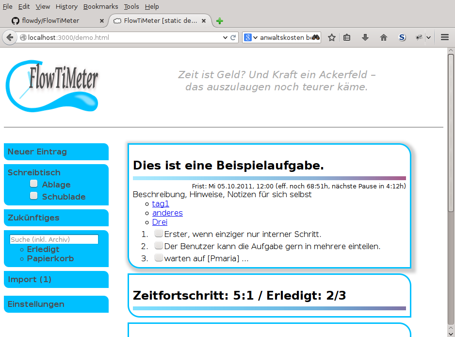

README
======

Was ist FlowgencyTM? - Die sieben wichtigsten Punkte
----------------------------------------------------

 1. FlowgencyTM ist ein Tool, um Aufgaben zu planen und zu verwalten, ihre Dringlichkeiten, Fortschritte und etwaige Abhängigkeiten. Es geht im Wesentlichen darum, Sachen in der vorher ausdrücklich für die Arbeit reservierten Zeit zu erledigen, abgesehen vielleicht von denen mit der geringsten Priorität. In einer Geschäftswelt, die vom Aberglaube des Multitasking besessen ist, hilft es, Aufgaben in einer festen Reihenfolge abzuarbeiten, denn so ist ein Flowerlebnis wahrscheinlicher.

 2. Die Benutzeroberfläche ist mit HTML5 und Javascript realisiert. Sie läuft also im Webbrowser deiner Wahl. Die Serverkomponente ist ebenfalls fester Bestandteil der Distribution. Sie ist so voreingestellt, dass du es auf deinem System lokal installieren kannst, und ausschließlich von diesem akzeptiert es Anfragen vom Browser.

 3. Die Aufgaben werden nach Dringlichkeit absteigend angezeigt. Die Liste wird aktualisiert, wann immer du auf das FlowgencyTM-Logo in der rechten oberen Ecke klickst. Du entscheidest, wann du deine angehakten, weil erledigten Schritte speichern willst und wann du bereit dafür bist, zu Aufgaben umzuschalten, die in der Zwischenzeit ggf. dringlicher geworden sind.

 4. In Flowgency gilt die Priorität einer Aufgabe nur als eine von fünf Dimensionen der Dringlichkeit, wenn auch die einzige, die du händisch angibst. Die anderen vier hängen von der Zeit ab:

   * Wie nah das Fristende liegt,

   * wieviel Zeit vergangen ist im Vergleich dazu, wieviel Aufwand du prozentual erledigt hast,

   * für wie lange die Aufgabe bereits offen ist (falls zutreffend) und schließlich

   * wann die Aufgabe eingedenk deiner Arbeitsgeschwindigkeit komplett erledigt sein wird im Verhältnis zum aktuellen Fristende.

   Alle Dimensionen kannst du nach deinem Dafürhalten wichten. Per Voreinstellung fließen alle in gleichem Maße in die Dringlichkeitsberechnung ein.

 5. Diese vier weiteren Dimensionen steigern sich mit der fortschreitenden Zeit. Damit ist jedoch nicht die übliche Systemuhrzeit gemeint, sondern die FlowgencyTM-eigene, die abhängig von deinem definierten Zeitmodell läuft oder stillsteht. Wenn sie steht, ist die Dringlichkeit sozusagen gefroren. Pausierende Aufgaben werden per Voreinstellung nicht in der Liste aufgeführt.

 6. Du kannst Aufgaben in Schritte unterteilen und diese wiederum bei Bedarf in Unterschritte. Du kannst beliebig tiefe Strukturen erzeugen. Manchmal haben Aufgaben/Schritte selbstverständliche Unterteilungen, sie explizit aufzuführen und zu beschreiben wäre lächerlich. Wenn du möchtest, kannst du stattdessen einfach die Anzahl von Häkchen definieren, diese bilden also lediglich gedachte Unterschritte.

 7. Es ist freie, offene Software lizensiert unter der General Public License, Version 3 oder einer späteren Version. Du kannst die Software kostenlos von GitHub herunterladen (URL: https://github.com/flowdy/FlowgencyTM), um sie zu verwenden. Gern kannst du auch ein eigenes Softwareprojekt davon ableiten.

So sieht Flowgency auf dem Bildschirm aus:

Was es nicht ist
----------------

FlowgencyTM ist es nicht gedacht zum Management komplexerer Projekte. Kosten-, Asset- und Risikomanagement finden keine Berücksichtigung. Es ist keine Groupwarelösung für ganze Unternehmen, obgleich grundlegende Funktionen wie Delegation geplant sind. Du bist natürlich willkommen, Schnittstellen für solche Lösungen beizutragen, etwa über die sich Aufgaben importieren oder Erledigtstatus zurückmelden lassen.

FlowgencyTM ist *nicht harmlos*. Die Serverkomponente für andere zu betreiben, damit sie nur einen Link klicken und sich anmelden brauchen, erfordert ethisches Verantwortungsbewusstsein. Falsch verwendet, kann sie Unternehmen wirtschaftlichen Schaden zufügen und möglicherweise sogar ganze Gesellschaften schädigen – sprich, sie leistet das Gegenteil dessen, wozu sie eigentlich programmiert wurde. Die Verwendung muss vor allem freiwillig sein, der/die Einzelne darf durch die Entscheidung dagegen keine negativen Folgen erleiden und sei dies dadurch, dass die Anwendung für andere mit einer Begünstigung verbunden ist.

Wie FlowgencyTM am ergiebigsten zu benutzen ist
-----------------------------------------------

### Definiere dein persönliches Arbeitszeitmodell

Neue Benutzerprofile werden mit einem pausenlosen Zeitmodell voreingestellt, lediglich um zu vermeiden, dass neue Nutzer durch scheinbar willkürlich ausgeblendete Aufgaben verwirrt werden. Es geht gerade nicht darum, »Workoholismus« zu fördern.

Um in Genuss eines richtigen dringlichkeitsbasierten Reihenfolge zu kommen, musst du dem Programm im Voraus mitteilen, wann du an eingetragenen Aufgaben arbeiten möchtest und wann nicht. Du planst gewissermaßen im Voraus deine Arbeitszeit. Du kannst das Zeitmodell jederzeit für die Zukunft ändern (etwa um anstehenden Urlaub einzutragen), aber Änderungen an den Daten vergangener Zeiten würden die Dringlichkeitsberechnung verfälschen. Entsprechende Versuche werden deshalb mit einer Fehlermeldung quittiert.

Um Missverständnissen vorzubeugen – es ist nicht erforderlich, dem Zeitmodell auf die Sekunde genau zu folgen (praktisch ist das ohnehin nicht möglich). Aber je genauer deine tatsächliche Arbeitszeit deinen Planungen entspricht, desto mehr kann FlowgencyTM dir nutzen. Dies erfordert etwas Disziplin. Zu einem gewissen Grad musst du auf Spontaneität verzichten, dafür dich an den Plan des Tages so weit wie möglich halten. Bei ungeplanten Notwendigkeiten, die deiner Aufmerksamkeit bedürfen, kannst du FlowgencyTM ein Ranking ausgeben lassen, wie es unter der Annahme entstünde, dass du von jetzt bis zum angegebenen Zeitpunkt nicht mehr an den Aufgaben arbeitest. So gibt es zumindest keine böse Überraschung wenn du wieder zurückkehrst.

Lege also fest: Wann arbeitest du? Wann befasst du dich ggf. mit welchem Job oder Projekt? Wann machst du Feierabend, bist abwesend von der Arbeit, dafür voll präsent für Familie und Freunde, Hobbies oder was auch immer? Wann möchtest du sozusagen einen berechnetes Mittel, um arbeitsbezogene Sorgen aus deinem Kopf herauszuhalten? Beachte jedoch, dass die Menge an Arbeitszeit sich direkt darauf auswirkt, wie schnell sich die Dringlichkeiten währenddessen erhöhen.

Das Zeitmodellsystem ist sehr flexibel, um für die Bedürfnisse hoffentlich vieler Benutzer gewappnet zu sein. Zum Beispiel kannst du auf einer Zeitschiene Variationen definieren, also vom Grundrhythmus abweichende Rhythmen zwischen zwei definierten Zeitpunkten, und zwar so, dass sie sich automatisch auf andere, verknüpfte Zeitschinen ebenfalls niederschlagen. Urlaubstage brauchen so etwa nur für die oberste Schiene definiert werden, andere übernehmen sie dann automatisch, und damit auch etwaige spätere Änderungen an ihnen.

Das hat allerdings seinen Preis: Es besteht das Risiko, dass du dein Zeitmodell unwillkürlich allmählich verkomplizierst und irgendwann nicht mehr verstehst, warum eine Aufgabe X plötzlich pausiert und aus der Liste verschwindet. Das ist ungünstig, reduziert deine Produktivität, weil es deine Aufmerksamkeit auf dein Zeitmanagement lenkt, weg von den Aufgaben selbst. Halte es also möglichst einfach. Schraube nicht fortwährend daran, ändere es am besten nur um genehmigten Urlaub einzutragen und wenn du deine Arbeit inhaltlich umstrukturierst bzw. du von Umstrukturierungen betroffen bist.

### Schätze deine Auszeiten

Aus heißt nicht Bereitschaft. Du brauchst nicht hin und wieder FlowgencyTM anzuklicken. Das wäre wie den Kühlschrank zu öffnen nur um zu kontrollieren, dass es darin dunkel ist.

### Strukturiere deine Aufgaben, es sei denn, sie sind einfach. Setze entsprechend Häkchen, wenn einzelne Schritte erledigt sind.

Trage Aufgaben ein, bevor du sie angehst. Trage auch einfache Aufgaben ein, wenn du dir nicht sicher bist, dass dies mehr Zeit beansprucht als sie gleich zu erledigen. Um FlowgencyTM deine Aufgaben richtig ordnen zu lassen, berücksichtige in deiner Planung folgende Punkte:

 * Wann willst du die neue Aufgabe angehen, wenn nicht jetzt, und zu wann?

 * *Wenn du mehr als eine Zeitschiene definiert hast:* Auf welcher willst die Aufgabe erledigen? D.h. wann soll sie in der Liste heraufklettern um Erledigthäkchen abzukriegen? Soll sie die Zeitschiene vielleicht zu einem bestimmten zukünftigen Zeitpunkt wechseln? Auch das ist möglich, hier sind aber Kosten (Komplexität) und Nutzen abzuwägen.

 * Welche Priorität hat sie?

 * Kann sie in einzelne beschriebene Schritte unterteilt werden? Welche davon können wiederum noch detaillierter unterteilt werden? Die Strukturtiefe ist technisch unbegrenzt.

 * Ist es erforderlich, diese Schritte und Unterschritte in der angegebenen Reihenfolge zu erledigen oder ist das irrelevant? Du kannst die Irrelevanz der Abfolge jeweils auf Teilmengen (Schrittgruppen) beschränken. Schritte bzw. -gruppen, die auf andere noch nicht erledigte Schritte bzw. -gruppen folgen, werden ebenso ausgeblendet wie bereits erledigte. Du kannst eine besondere Gruppe von Schritten definieren, die außerhalb jeder Reihenfolge abgehakt werden können.

 * *Für fortgeschrittene Nutzer:* Wie zeitaufwendig ist der einzelne Schritt ungefähr im Verhältnis zu den Schritten, die ihn in der Hierarchie umgeben? Voreingestellt ist 1 und es gibt wahrscheinlich nicht oft einen Anlass, dies zu ändern.Änder das nur, wenn du dir sicher bist.

 * Wieviele Häkchen sollen zur Aufgabe bzw. zum einzelnen (Unter-)Schritt gesetzt werden? Voreinstellung ist eins. Mehr Häkchen sind angezeigt, wenn sich der Aufwand der weiteren Unterteilung mit Beschreibung, Aufwandsschätzung etc. nicht lohnt, der Schritt aber eigentlich weiter unterteilt werden könnte.

Ist die Aufgabe (bzw. ggf. mehrere Aufgaben in einem Schwung) richtig eingetragen, klicke auf das FlowgencyTM-Logo, um sie in die Datenbank zu speichern. Wahrscheinlich werden sie erst einmal eher im unteren Bereich der Liste eingeordnet. Du kannst sie also fürs erste wieder vergessen. Arbeite die Liste immer von oben ab. Hake jeden Schritt gleich ab, sobald er erledigt ist.

Immer wenn du deine gesetzten Häkchen speichern willst und mental bereit bist, ggf. mit neuen, plötzlich dringenderen Schritten konfrontiert zu werden, klicke auf das Logo. So wird die Liste auf den aktuellen Stand der Dringlichkeiten gebracht. Aufgaben, deren aktuelle Zeitschiene gerade eine Pause durchläuft, erscheinen nicht in der Liste oder ausgegraut, falls die entsprechende Anzeigeoption links gesetzt ist. Sie steigen nicht auf, fallen eher, indem sie von anderen, aktiven Aufgaben überklettert werden.

Wofür das alles, was ist die Vision?
------------------------------------

In einem größeren Maßstab, falls die Software von vielen verwendet wird, ist meine Hoffnung, dass FlowgencyTM als feedbackgesteuerter »Schrittmacher« in der Gesellschaft regelmäßige, gesunde Rhythmen von Ent- und Anspannung fördert. Ohne diesen droht ihr bald ein Kollaps. Entschleunigung und Rerhythmisierung tut not.

Es ist Zweifel daran angebracht, ob eine Software das leisten kann. In einer Ära quasireligiöser Verehrung der Informationstechnologie im Allgemeinen (Der Computerpioneer und zuletzt Technologiekritiker Joseph Weizenbaum lehrte mich, das zu hinterfragen), ist es jedoch an der Zeit, Computern beizubringen, dass seine »Schöpfer« regelmäßige Auszeiten brauchen. Die sitzen übrigens am längeren Hebel, schließlich versorgen sie die Computer letztlich mit Energie. Versuche, sich auf ihren agnostischen pausenlosen GHz-Rhythmus einzustimmen, sind idiotisch. Das ist wie sich vom eigenen Kind sagen zu lassen, was zu tun ist. Behalte auch im Hinterkopf: Die Konkurrenz schläft nicht. Sie leidet unterm Burnout-Syndrom ;-).

Ich hoffe, du bekommst durch FlowgencyTM mehr Flow-Erlebnisse – daher der Name – denn du lernst dich besser zu fokussieren, auf gerade anliegende Aufgaben im Beruf genauso wie auf das Lebens außerhalb.

Das Konzept im Detail
---------------------

Dies ist eine Zusammenfassung. Siehe die [ausführliche Fassung](doc/konzept.de.md).

Installation
------------

FlowgencyTM ist ein Prototyp, sogar nur ein »Proof of concept«, der sauber und reibungslos funktionieren oder bitter scheitern kann. Gerne kannst du diese Version mit Testdaten verwenden. Beachte, dass diese Software alpha ist, also Crashs und eine regelmäßig korrumpierte Datenbank auftreten können. Also bitte nicht produktiv verwenden, schon gar nicht für Vitales. Wenn du dir nicht anders helfen kannst, dann tu's halt, aber jammere nicht, du hättest keine aktuelle Sicherung zur Hand. Hiermit bitte ich außerdem um Bug-Reports und bedanke mich im Voraus.

FlowgencyTM ist in der Programmiersprache Perl implementiert, Version ab 5.14. Mac OS X und die meisten Linuxdistributionen haben es gebrauchsfertig mit an Bord, überzeuge dich davon mit dem Kommando `perl -v` oder recherchiere im Netz, wie du auf deinem System Perl installierst. Windowsnutzern wird Strawberry Perl empfohlen, bitte kostenlos herunterladen unter <http://strawberryperl.com/>.

Klone das git-Repository in ein beliebiges Verzeichnis. Unter Linux genügt dazu der folgende Befehl:

    git clone <https://github.com/flowdy/FlowgencyTM.git>

Für andere Systeme stelle sicher, das Git installiert ist und führe die entsprechenden Schritte durch (s. Manual).

Überprüfung der Abhängigkeiten
------------------------------

Prüfe und installiere die vorausgesetzten Drittmodule, indem du im FlowgencyTM-Verzeichnis folgenden Befehl ausführst (wiederum nötig dafür ist der cpanm Installer):

    cpanm --installdeps .

Das Programm ausführen
-----------------------

At a shell prompt, under the FlowgencyTM directory, run the command
Am Shell-Prompt führe bitte im FlowgencyTM-Verzeichnis das folgende Kommando aus:

    script/morbo

Bitte schließe nicht das Terminalfenster, weil es ggf. hilfreiche Meldungen ausgibt, wenn etwas schief läuft. Öffne nun den am Ende angezeigten Link in deinem Lieblings-Browser. Falls du eine lokale Firewall installiert hast, ist es nicht auszuschließen, dass diese Zugriffe von innerhalb des Systems verhindert, warum auch immer. Sieh im Handbuch deiner Firewall-Software nach, wie du entsprechende Ausnahmen konfigurierst, um HTTP-Zugriffe von und auf dein eigenes System zuzulassen (noch besser, kontaktiere deinen Administrator, falls vorhanden).
 

Welche anderen Open Source-Projekte verwendet werden
----------------------------------------------------

  * Perl – die für die Serverkomponente verwendete Programmiersprache
  * Moose.pm – Ein modernes Objektsystem für Perl
  * Date::Calc – Zeitbezogene Berechnungen
  * SQLite, DBIx::Class – Datenbankschema
  * Mojolicious – für die Serverseite verantwortlich, so behältst du die volle
     Kontrolle über deine Daten und bist nicht auf die Verfügbarkeit Dritter
     angewiesen
  * Firefox – zum Testen und Benutzen von FlowgencyTM (+ andere Browser)

Autor / Projektinitiator kontaktieren
-------------------------------------

(Adresse aufgesplittet, um Spam zu verhindern. Einfach zusammensetzen und "@" als Ersatz für "bei".)

    fhess bei mailbox. org

Copyleft und Lizenz
---------------------

(C) 2012, 2013, 2014 Florian Heß

FlowgencyTM ist freie Software. Sie können es unter den Bedingungen der GNU General Public License, wie von der Free Software Foundation veröffentlicht, weitergeben und/oder modifizieren, entweder gemäß Version 3 der Lizenz oder (nach Ihrer Option) jeder späteren Version.

Die Veröffentlichung von FlowgencyTM erfolgt in der Hoffnung, daß es Ihnen von Nutzen sein wird, aber OHNE IRGENDEINE GARANTIE, sogar ohne die implizite Garantie der MARKTREIFE oder der VERWENDBARKEIT FÜR EINEN BESTIMMTEN ZWECK. Details finden Sie in der GNU General Public License.

Sie sollten ein Exemplar der GNU General Public License zusammen mit FlowgencyTM erhalten haben. Falls nicht, siehe <http://www.gnu.org/licenses/>. 
