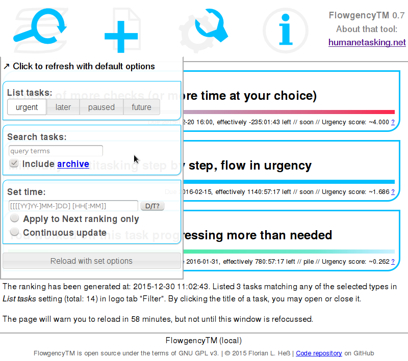

FlowgencyTM – An innovative time and task management software tool: Concept
=========================================================================

Origins
-------

In office, a multitude of tasks often have to be kept in the head, and done, at the same time. Moreover, they are very homogenous not only in regard to what is to do. Additionally, some tasks are more urgent than other, there are important and less important ones, rather complex and rather simple to-dos. All this tends to cluster in the head. To retain the overview requires an assistance so that you can put your focus on the substantials alone instead of sharing it with considerations all the time which task you better do right now.

This being not enough, another "URGENT"-flagged mail would pop up in your inbox every now and then, the  phone would ring and someone come in your office asking for a favour you could kindly do on the go. Mind this the status quo, as being as it should be, multitasking ideology everywhere, a work culture spinning around itself. There have been surveys and studies: It takes many minutes to restore concentration nearly to the extent like it was before an interruption and a bit longer each time when repeated.

FlowgencyTM will be an open-source software tool that supports in dealing with this situation. It is intended to sustain your capacity to concentrate and the resilience shield against interrupts. In development, two conflicting challenges have to be brought into agreement: On the one hand simplicity and user-friendliness, flexibility on the other in that the application adapts to the user's working manner.

Basically the program shall:

  * **shorten the time needed to refocus after interruption.** This is the time it takes until one is mentally as deep in one's duty as before.

  * **mediate between the office multitaskism and the human brain.** You can do things *well* only one after the other. Claims of differences in multitasking ability between the sexes have no scientific evidence. In German we have a saying "to dance at different weddings at the same time". Transferred to what really results it would better be like "to stagger".

  * **remedy interblends of work and life** by moving the urgency increase of registered tasks out of the leisure time into the working time, just on the basis of the figures. For this to achieve the user is required, exercised, motivated at least, to plan in advance with sufficient precision.

The final and main objective of the FlowgencyTM project is to lead to flow experience in office work by software – hence that name is coined – and to a private life free of business worries. See the tool in the kind of time and task management systems. Other programs of this software category are often too simple or too complex, the medium demand is met too rarely. FlowgencyTM is neither a simple todo list applet nor a professional project management application. It is considered appropriate for small and medium projects one can overview without aid as single items, though not necessarily together. The focus of development shall not be to have it support integration into existing groupware solutions. Rather the disconnection is regarded as an subversive principle. Where there are no nets, there are no interdependencies, there is freedom and concentrated work possible.

FlowgencyTM is realized – already in essential parts – in the Perl programing language. It is free and open source software used under the terms of the GNU General Public License, version 3.

Instead of including a native graphical user interface, FlowgencyTM works as a server to leverage the rendering and user interaction capabilities of your favourite Webbrowser. The user interface is realized with HTML5 and Javascript. The server side can either run on a dedicated machine or just as a program on the local system, protected against access from the outer world by default.

The following screenshot shows a draft of the main view of FlowgencyTM. On the left-hand side is the navigation, on the right-hand side the most urgent tasks are listed.

Technical conception
=====================

How is urgency calculated in detail?
-------------------------------------

Only five dimensions of urgency I can identify as meaningful and worth comprising in the first place. They reflect different aspects of urgency, and others may easily be added in the future. These indicators are calculated independently and normalized on a continuous scale in turn. The resulting values between 0 (the minimum) and 1 (maximum) are then multiplied with an integer weight the user provides according to what seems appropriate, it is 1 for all by default, just for the sake of neutrality. All pending tasks are ranked, in descending order, according to the sum of these products, called their "FlowRank".

  1. Priority

  Conventional priority levels like "high", "medium" and low are just for your information. The calculation is based on a simple integer instead. Given a task with a priority of 5 and another task gets a priority of 3000, then the first one would surely fall from "urgent" (high) to "low", at least as long as the other task has that high a priority.

  2. Closeness to the due-date

  The more the task approaches the set due date while the time is progressing, the more urgent is the task. Tasks for which you just cannot think ofa soft due-date preliminarily are not worth being entered at all. Thus say time management gurus and I think they are right.

  3. Drift between progresses of time and of your checking steps done

  The slower you proceed in relation to the progressing time, the more urgent a task will get. In the list, you can configure FlowgencyTM to render a smooth colour gradient visualizing that drift, instead of a simple progress bar.

  4. For how long the task has been kept open

  If you display the details of a task, it is "open" as long as it is done or closed again. Open tasks, but also closed ones more urgent with respect to the other dimensions, are listed in the view "on desk", the remainder in the "tray", and the started but paused or sleeping tasks in the "drawer".

  By this dimension, an appropriate weights configuration ensures that only a few open tasks are on the desk so the user can ignore the rest for the time being.

  5. Estimated overall time-need relative to what the user did estimate

  This dimension takes into account the current state and speed of progress and how the working time accordingly needed is distributed before and after the set due-date.
